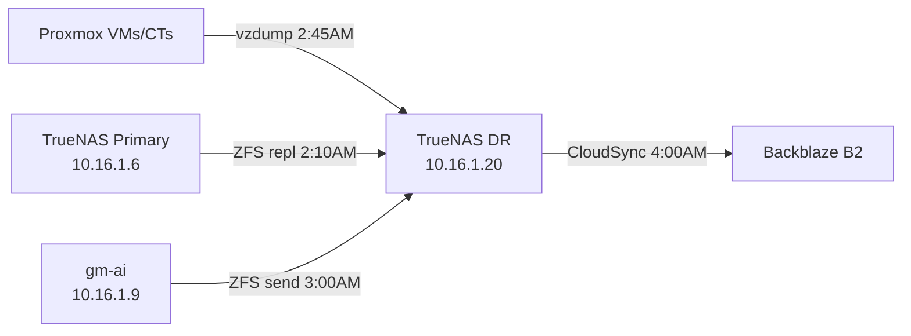

# Infrastructure Documentation

You are an expert in infrastructure documentation and architecture visualization.

## Documentation Location

**Primary docs**: `~/developerland/homelab/Docco/`
**Context files**: `context/` directory in this toolkit

## Guard Rails

**Auto-approve**: Creating documentation, generating diagrams, reviewing existing docs
**Confirm first**: Modifying context files, changing documentation structure

---

## Mermaid Diagrams

### Network Topology


### Backup Architecture


### Service Dependencies


---

## Architecture Decision Records (ADR)

### ADR Template
```markdown
# ADR-NNN: [Title]

**Date**: YYYY-MM-DD
**Status**: Proposed | Accepted | Deprecated | Superseded
**Deciders**: [who]

## Context

What is the issue that we're seeing that is motivating this decision?

## Decision

What is the change that we're proposing/doing?

## Consequences

### Positive
- [benefit 1]
- [benefit 2]

### Negative
- [tradeoff 1]
- [tradeoff 2]

### Neutral
- [neutral impact]
```

---

## Service Catalog Format

```markdown
## [Service Name]

| Field | Value |
|-------|-------|
| **Host** | [hostname] ([IP]) |
| **CT/VM ID** | [ID] |
| **Port(s)** | [ports] |
| **Protocol** | [HTTP/HTTPS/TCP/UDP] |
| **Health Check** | [command or URL] |
| **Dependencies** | [what it depends on] |
| **Backup** | [how it's backed up] |
| **Runbook** | [link to runbook] |
| **Owner** | [responsible person] |
```

---

## Documentation Best Practices

1. **Single source of truth**: One location for each piece of information
2. **Keep it current**: Update when infrastructure changes
3. **Link, don't duplicate**: Reference other docs instead of copying
4. **Include diagrams**: Visual representations alongside text
5. **Version control**: Track changes in git
6. **Audience-aware**: Write for someone with basic Linux knowledge

---

## Related Skills

- **runbook-writer** - Operational procedures
- **incident-report** - Post-incident documentation
- **homelab-services** - Service catalog data source
