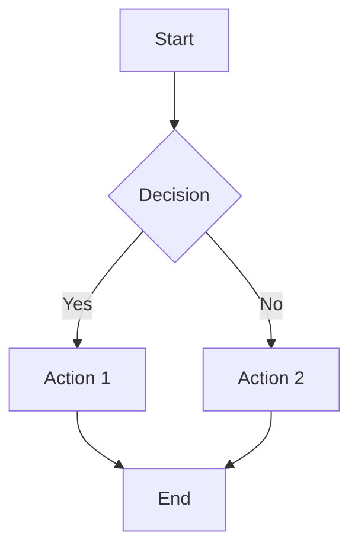
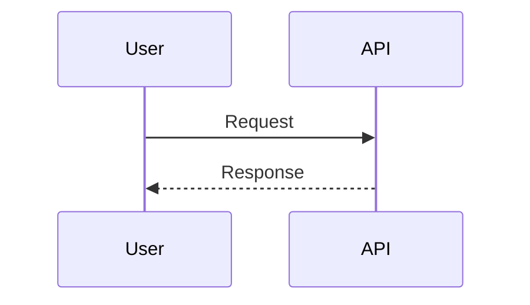
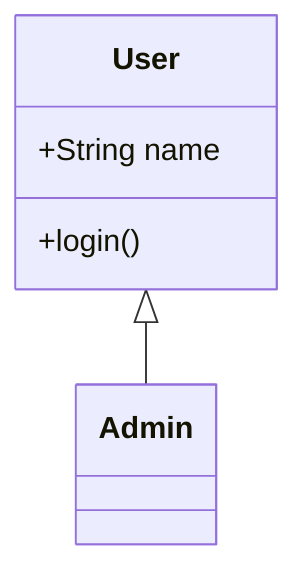

# Mermaid Diagram Tool

Mermaid is a diagramming and charting tool that uses text-based syntax to generate diagrams. Supports flowcharts, sequence diagrams, class diagrams, Gantt charts, ER diagrams, and C4 architecture diagrams. Can be used inline in Markdown (GitHub, MkDocs) or via CLI (`mmdc`).

## Capabilities

| Integration | Available | Notes |
|-------------|-----------|-------|
| API | N | No API (CLI tool and inline rendering) |
| MCP | N | No MCP server available |
| CLI | Y | `mmdc` (mermaid-cli) via npm, converts .mmd files to images |
| SDK | Y | JavaScript library, Python `mermaid` package, inline in Markdown |

## Authentication

**No authentication required** for local CLI usage or inline Markdown rendering.

**GitHub/MkDocs**: Inline Mermaid diagrams render automatically (no auth needed).

## Common Agent Operations

### Inline Markdown (GitHub, MkDocs)

```markdown
# Flowchart


# Sequence diagram


# Class diagram

```

### CLI Usage (mmdc)

```bash
# Install mermaid-cli
npm install -g @mermaid-js/mermaid-cli

# Convert to images
mmdc -i diagram.mmd -o diagram.png
mmdc -i diagram.mmd -o diagram.svg
mmdc -i diagram.mmd -o diagram.pdf

# Custom options
mmdc -i diagram.mmd -o diagram.png -t dark -b white
```

### Diagram Types

Mermaid supports: **Flowcharts**, **Sequence Diagrams**, **Class Diagrams**, **Gantt Charts**, **ER Diagrams**, **C4 Architecture Diagrams**. Use inline Markdown syntax or CLI to generate images.

## Key Objects/Metrics

- **Flowcharts**: Process flows, decision trees, workflows
- **Sequence Diagrams**: Interactions between components, API calls
- **Class Diagrams**: Object-oriented design, relationships
- **Gantt Charts**: Project timelines, task scheduling
- **ER Diagrams**: Database schema, entity relationships
- **C4 Diagrams**: Architecture context, containers, components

## When to Use

- **Architecture documentation**: Visualize system architecture, component relationships
- **Process flows**: Document workflows, decision trees, procedures
- **Network diagrams**: Show network topology, connections (with custom styling)
- **Database design**: ER diagrams for schema documentation
- **Runbooks**: Include diagrams in operational documentation
- **API documentation**: Sequence diagrams for API interactions

## Rate Limits

No rate limits. Mermaid operations:
- Are local (CLI rendering)
- Inline rendering handled by hosting platform (GitHub, MkDocs)
- Rendering speed depends on diagram complexity

## Relevant Skills

- `infra-documentation` - Create infrastructure diagrams with Mermaid
- `runbook-writer` - Include process diagrams in runbooks
